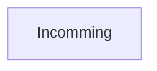

# AI Simulation of Creature Evolution in a Terrestrial Environment

## Summary

 1. [Description](#description)
 2. [Technology Choices](#technology-choices)
 3. [Pre-Coding Considerations](#pre-coding-considerations)
	* what is a creature?
	* nodes characteristic and contraints
	* muscles characteristic and contraints
	* creature schema
 4. [Creation Process](#creation-process)
 5. [Challenges Faced and Solutions Implemented](#challenges-faced-and-solutions-implemented)
 6. [Testing](#Testing)
 7. [Result](#Result)

## Description
This project involves the creation of an artificial intelligence (AI) simulation of creature evolution in a terrestrial environment. The goal is to create an interactive environment where users can observe the evolution of creatures and their adaptation to their surroundings.

## Technology Choices
For creating shapes and graphical elements, we will use the **[p5.js](https://p5js.org)** library. For graphics, we will use **[D3.js](https://d3js.org)**. For dependency management and code compilation, we will use **[Node.js](https://nodejs.org)** and **[Webpack](https://webpack.js.org)**.

## Pre-Coding Considerations

Before coding, we need to conduct thorough research on the basic principles of evolution simulation and techniques for modeling a terrestrial environment. We will then need to design a creature model with physical and behavioral characteristics that can evolve over time. We will also need to design a reward and penalty system to guide creature evolution.

**what is a creature?**
a creature will be the combination of one or more nodes each connected to one or more muscles. All of these elements together form a creature and can try and learn how to evolve in a given environment

**nodes characteristic and contraints**
	
	 - Collided with the ground
	 - Friction from 0 to 1 (ground grip resistance)
	 - Can be connected to another node with muscles
	 - Pass throught others nodes

**muscles characteristic and contraints**

	 - Extension max length and expected length
	 - Contraction max length and expected length
	 - Extension / Contration time
	 - Strength*
	 - Should be connected to two nodes (one from each side)
\* *ratio used to trying to reach the desired length after Contration or Extension.*

**creature schema :**

## Creation Process

1.  Creature model design: We will design a creature model consisting of nodes and muscles. The nodes represent the body parts of the creature, while the muscles are the connections between these parts. Each node and muscle will have specific physical and behavioral characteristics.
    
2.  Definition of node characteristics and constraints: The nodes will have characteristics such as collision with the ground, friction (ground grip resistance), the ability to connect to other nodes via muscles, and the ability to pass through other nodes.
    
3.  Definition of muscle characteristics and constraints: The muscles will have characteristics such as maximum extension and contraction length, extension and contraction time, strength, and connection to two different nodes.
    
4.  Environment definition: We will define the characteristics of the terrestrial environment in which the creatures will evolve. This may include elements such as the presence of water, food, and other creatures.
    
5.  Implementation of the evolution algorithm: We will use a genetic algorithm to simulate the evolution of creatures over time. We will define a reward and penalty system to guide creature evolution towards desirable behaviors.

## Challenges Faced and Solutions Implemented
## Testing
## Result
